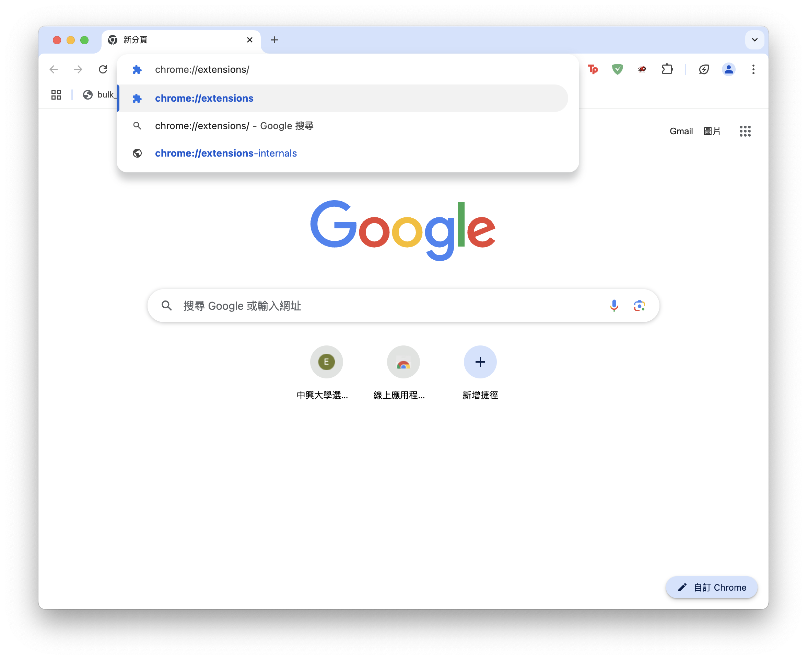
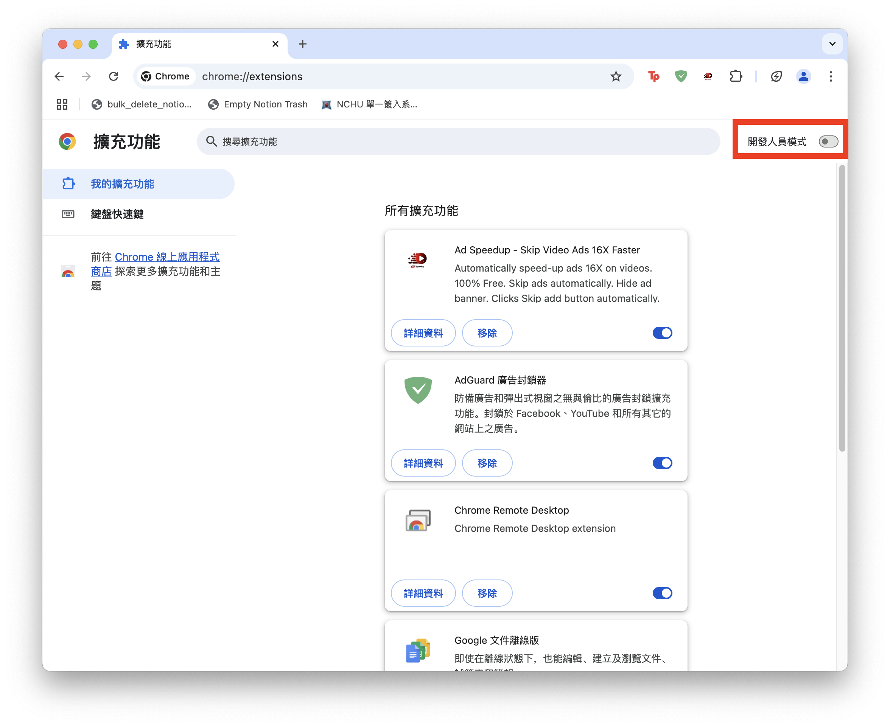
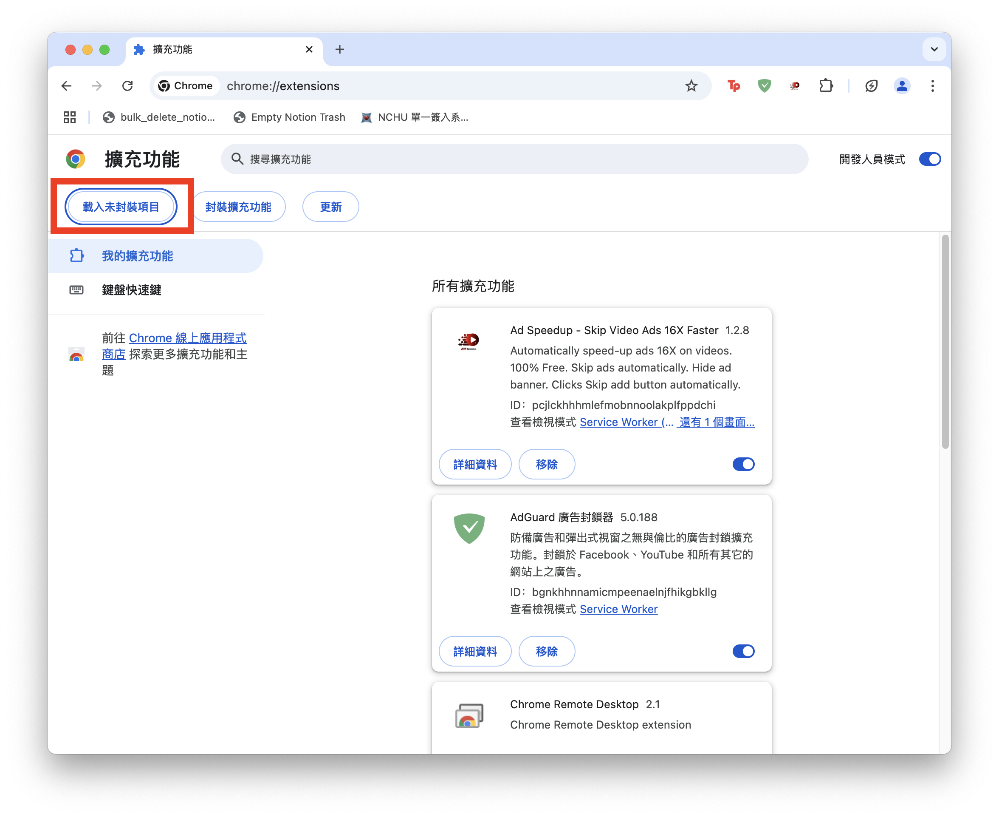

# NCHU_captcha
## 這是一個由懶惰鬼開發出來的程式

NCHU_captcha 是一個用於 NCHU自動填寫驗證碼的瀏覽器擴充套件，目前打算開發中Safari、Chrome等常見瀏覽器的擴充套件

## 功能特點

- **自動填寫驗證碼**
- **跨平台支持**：同時支持 iOS 和 macOS 平台的 Safari 擴充功能以及chrome的擴充功能

## 使用說明

### Safari
1. 到[這裡](https://apps.apple.com/tw/app/nchupass/id6738906195)下載並安裝App
2. 依照App的使用說明進行操作

### Chrome
1. 到[這裡](https://github.com/EricYang801/NCHU_Captcha/releases/tag/v0.0.1-alpha)點選extension.zip下載
2. 解壓縮extension.zip
3. 打開chrome並進入`chrome://extensions/`  
    
4. 開啟開發者模式（位於右上角）
    
5. 點選載入未封裝項目
    
6. 選擇剛剛解壓縮的資料夾
7. 安裝完成

## 貢獻

在此感謝這篇貼文的學長姐給我構建程式碼的想法[查看 Dcard 貼文](https://www.dcard.tw/f/nchu/p/253176849)

## 許可證
使用 MIT 許可證。有關詳細資訊，請參閱 [LICENSE](./LICENSE) 檔案。

